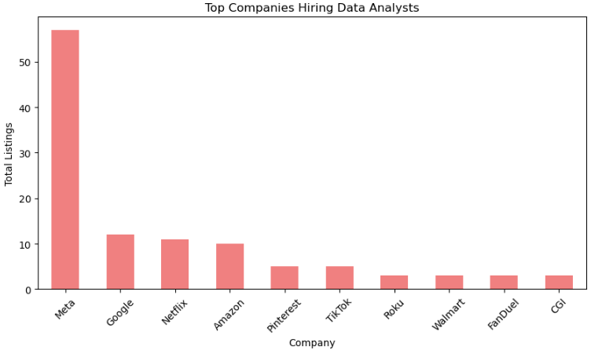
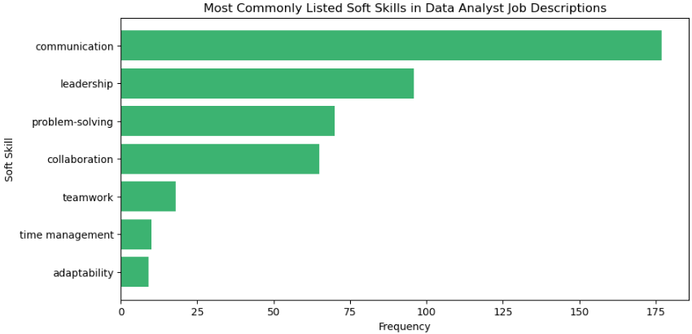

# Exploratory Data Analysis: Is Data Analysis Still a Worthwhile Profession?

## 📌 Project Overview
This project explores job postings for data analyst roles to assess whether data analysis remains a viable career path.

## 🔍 Key Questions
1. **Which locations offer the most job opportunities?**
2. **Which companies are actively hiring data analysts?**
3. **What soft skills are commonly listed in job descriptions?**

## 📊 Data & Methodology
- **Dataset:** A collection of job postings from LinkedIn, including details on company, location, description, and posting date, downloaded from Kaggle.
- **Tools Used:** 
  - Python (`pandas`, `matplotlib`, `seaborn`)
  - Jupyter Notebook

## 📈 Key Findings

- **Location Insights:** The highest concentration of job postings in the U.S. are in New York, California, and Washington.

- **Hiring Companies:** Meta is leading in hiring data analysts by a large margin.

- **Soft Skill Trends:** Communication and leadership are among the most frequently requested skills.

## 🚀 Conclusion
Based on this analysis, data analytics continues to be an in-demand profession, particularly in major tech hubs and certain industries. However, focusing on soft skills alongside technical expertise is crucial for staying competitive.

## Project Review
Using Pandas, Matplotlib, and Seaborn is a quick way to clean, analyze, and visualize data for EDA, but I do see the appeal in using Tableau or PowerBI for more engaging visualizations.
I only finished the Python, Pandas, and Numpy tutorials this week, so I am still leaning on documentation and Copilot for a lot of help.
The code used to generate the first 2 visuals is fairly straight forward, but the third one utilizes counters which are more complicated. 
I will get better.
